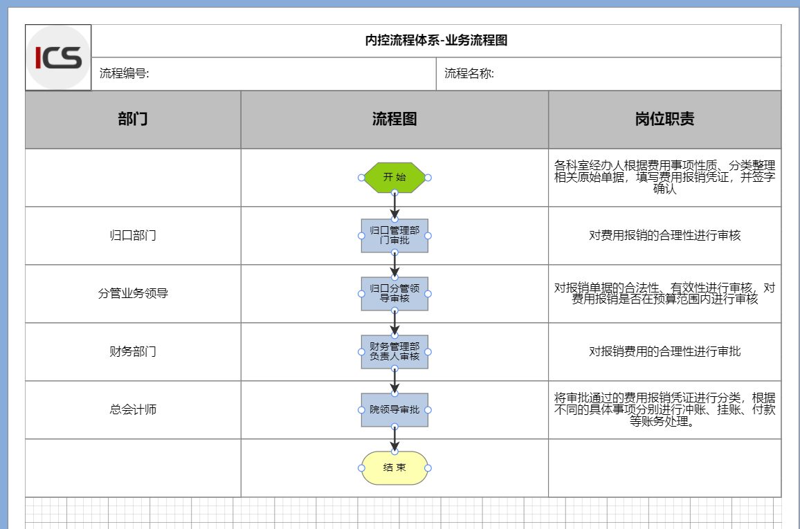
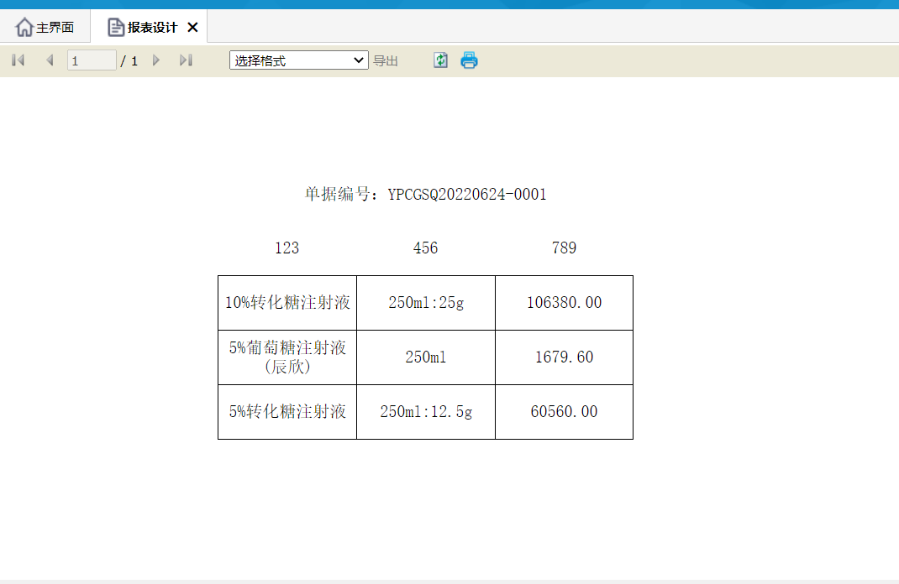
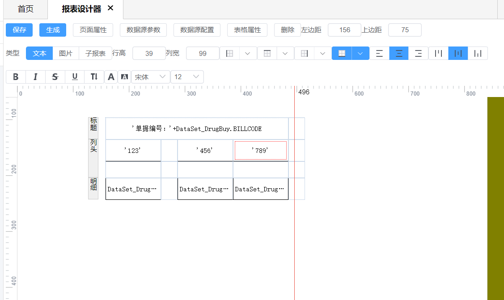

# ZSFlowEditor

#### 介绍
使用 vue3 、Vite 、 AntV X6 完成的流程设计器。设计器主要的用途为ERP类项目的流程审批。因为平台旧版本使用的SilverLight流程设计器，然后按照项目需求和原有的样式制作的一模一样的设计器。支持 职能带、节点属性、边条件表达式等。

#### 项目说明

基于内控场景的业务流程图，要求和市场上的流程图不太一样，最早流程图分业务域、流程图、活动图、步骤图，要求依据流程设立风险点、控制点与岗位职责。对接后续的风险预警模块，关联控制点和风险事项，建立控制、监控、预警体系，最终实现风险测评的目的。

根据需求，后续持续优化改进。
    
|  日期 |更新说明 |
|---|---|
| 2021-08-30  | 增加mockjs、增加演示数据  |
|---|---|
| 2021-08-27  | 初始化仓库  |


#### 安装教程

安装依赖

```shell
npm install
```

启动本地调试

```shell
npm run dev
```

#### 项目截图





#### 参与贡献
工作很多年，希望能把一些不同于市面上的东西拿出来分享交流，让大家一起进步。
    


 
